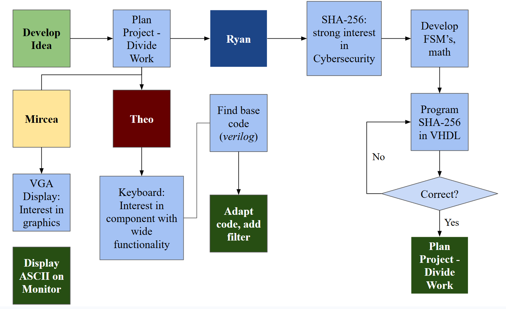

# cpe_487_finalProject_csecModule
*Theodore Rogalski, Ryan Manley, Mircea Florescu*
## Introduction
This project implements the SHA-256 hashing algorithm on a Nexys A7-100T FPGA using VHDL, with plaintexts entered using a USB keyboard and the output displayed through the VGA port on the FPGA.
## Expected Behavior 
The expected behavior of the system is as follows, first in sentences and then in bullet points.

### Written Description 
The user connects a keyboard and monitor to the FPGA  using the keyboard’s USB cable and VGA HDMI Adapter respectively. Then, they may upload the code onto the board, and will be able to type an arbitrary 32 bit (8 hex characters, 4 bytes, 4 ASCII characters) into it. As they type, they will see both the inputted text from the keyboard on the screen in ASCII as well as the plaintext run through the well known SHA-256 hashing algorithm as in the following image:

## INCLUDE IMAGE HERE

### Bullet Point Description


## Background
The SHA-256 hashing algorithm converts a plaintext into a 256-bit hash. Details on this process are available [here](https://www.boot.dev/blog/computer-science/how-sha-2-works-step-by-step-sha-256/#step-5---create-message-schedule-w). Implementing this algorithm on an FPGA requires the usage of a hardware design language, in this case VHDL. Convenient entry of plaintext is made possible by the usage of a peripheral keyboard. The result of the encoding may be displayed on the screen using the VGA port.
## Tutorial
# Parts Needed
1. Nexys A7-100T FPGA Board
2. VGA-HDMI Connector (Ventron Brand confirmed working)
3. Keyboard with USB cable connection
4. Monitor with HDMI Port 

# Step-by-Step Instructions

1. Open the Vivado IDE (version 2025.2 confirmed working)
2. Download the CPE487_Cybersecurity_Module folder, and open it using the Vivado IDE
3. Click Generate Bitstream in the bottom left
4. Once the bitstream has finished generating, click "Open Hardware Manager" and then “Program Device”
5. Once device finishes programming, type on keyboard and watch as ASCII characters appear on the screen!
6. The higher text is the input, and the lower text is the SHA256 output for it
## Video below:

 
High Level System Diagram
 

FSM For SHA 256 Module
  

Filtration Mechanism


# Input, Output Description for Each Module 
## SHA-256 Module
The SHA-256 Module is meant to take in input of a 440-bit plaintext (the plaintext allowed for one "chunk" in the SHA-256 algorithm)
## VGA Module
## Keyboard Module
### Introduction 
The keyboard module for this project is takes in data from a USB-coneccted keyboard and puts it into a 32 bit (32 bits chosen for full display on the seven segment display on the FPGA, could be arbitrarily increased) std_logic_vector. The purpose of this module is twofold: firstly to allow a user to enter a realistic message into the SSHA-256 algorithm, and secondly to allow future projects to forgo the use of buttons in their project's entirely. This code is adpated from [this online demo project](https://digilent.com/reference/programmable-logic/nexys-a7/demos/keyboard?srsltid=AfmBOoqqI4njcBqFtA0dqAeLQ5OywOiShAH1nz5cMmf3-alkugWLdGOD). However, the original code had two issues: firstly, that it was written in verilog and the final project was meant to be in VHDL and that instead of simply shifting a code XX corresponding to the keyboard key pressed into the vector, an additional code F0XX was shifted upon button release. Thus, this module filters out those extra statements. 
### Major Modifications


The keyboard module, at a high level, consists of the following inputs, outputs: 

### top.vhd
CLK100MHZ : in std_logic: This signal is a 100MHz clock, inputted from the clock wizard. It is fed into a 100 MHz. The clock signal to the seven segment display is also fed this signal.


PS2_CLK : in std_logic: 

PS2_DATA:in std_logic:

SEG : out std_logic_vector(6 downto 0:
The SEG signal (fed into the constraints file) activates the various line segments present in the hexidecimal display, allowing the user to view the keyboard input on the hexadecimal output.

AN  : out std_logic_vector(7 downto 0):
The AN signal, fed into the AN signal in the constraints file, controls whether each segment in the 8 hexadecimal character display is on. 
DP : out std_logic: The DP signal, set to permanently be one, is fed to the constraints file. 


UART_TXD : out std_logic:
UART_TXD converts the parallel bit stream coming from the keyboard into a std_signal. It is fed into the constraints.

Seg7display.vhd
x : in std_logic_vector(31 downto 0): 
The x vector represents the keycode data. It uses the digit variable, which loops through each four bit portion of x. 
```vhdl
process(clk) 
variable digit : std_logic_vector(3 downto 0);

begin
if rising_edge(clk) then
case(s) is
when "000" => 
digit:=x(3 downto 0);
when "001" =>
digit:=x(7 downto 4);

when "010" =>
digit:=x(11 downto 8);

when "011" =>
digit:=x(15 downto 12);

when "100" =>
digit:=x(19 downto 16);

when "101" =>
digit:=x(23 downto 20);

when "110" =>
digit:=x(27 downto 24);

when "111" =>
digit:=x(31 downto 28);

when others =>
digit:=x(3 downto 0);
end case;
case(digit) is 
when x"0" =>
SEG<="1000000";
when x"1" =>
SEG<="1111001";

when x"2" =>
SEG<="0100100";

when x"3" =>
SEG<="0110000";

when x"4" =>
SEG<="0011001";
when x"5" =>
SEG<="0010010";
when x"6" =>
SEG<="0000010";
when x"7" =>
SEG<="1111000";
when x"8" =>
SEG<="0000000";
when x"9" =>
SEG<="0010000";
when x"A" =>
SEG<="0001000";
when x"B" =>
SEG<="0000011";
when x"C" =>
SEG<="1000110";
when x"D" =>
SEG<="0100001";
when x"E" =>
SEG<="0000110";
when x"F" =>
SEG<="0001110";
when others => SEG<="0000000";
end case;
end if;
end process;
```
This process converts the digit signal into a value on the x vector, which is fed into the x vector, which is then displayed as data on the board.


clk : in std_logic:

SEG : out std_logic_vector(6 downto 0):

AN : out std_logic_vector (7 downto 0):
```
process(s)
begin
AN<="11111111";
if aen(conv_integer(unsigned(s))) = '1' then
AN(conv_integer(unsigned(s)))<='0';
end if;
end process;
end architecture;
```
This code continuously toggles the anode to be off (from the all one's s signal), thus allowing the board to be persistently on. The anode being '1' turns off the display segment. 

DP : out std_logic:


### ps2receiver.vhd
clk : in std_logic: 
kclk : in std_logic: 
kdata :in std_logic: 
keycodeout : out std_logic_vector(31 downto 0): 


## SHA-256 Module
## VGA Module


## Summary of Development Process
The project followed the proceeding structure, with each member contributing according to their interests:

Timeline:
![image][CPE487_Table.png]

Difficulties Encountered:
Many major difficulties were encountered in the course of the project, the first being the overly ambitious scope. The usage of a sending/receiving antenna for encrypting received messages and transmission presented excessive technical difficulties, which caused the project scope to be scrapped. The following challenges were the most notable for each module:
- SHA256 Module: Given the huge amoutn of operations present in SHA256, the correct implementation, especially with the large lead time present in VHDL due to the syntehsis, implementation and generate bitstream processes caused major difficulties. This led to the completion of the project being delayed to the last minute.
- Keyboard Module: Although the conversion of the keyboard module from verilog tro VHDL presented difficulties in learning how to read a new HDL, the most difficult aspect of the module was by far the filtering. The slow feedback present in VHDL and unclear issues resulting from changes to the logical structure of the keyboard module resulted in challenges that caused the delay of project completion. This issue was solved by slowing down the iteration process and pair programming.
- VGA Sync: The VGA Sync module faced the tremendous challenge of converting every hexcode into an ASCII character, which was done by hand, a long process which was faced with many fragility issues.


System Integration:
![image][System_Integration.png]
The above is a high-level description of the system, with the connections between the VHDL modules described.

A description of the expected behavior of the project, attachments needed (speaker module, VGA connector, etc.), related images/diagrams, etc. (10 points of the Submission category)
The more detailed the better – you all know how much I love a good finite state machine and Boolean logic, so those could be some good ideas if appropriate for your system. If not, some kind of high level block diagram showing how different parts of your program connect together and/or showing how what you have created might fit into a more complete system could be appropriate instead.


A summary of the steps to get the project to work in Vivado and on the Nexys board (5 points of the Submission category)
Description of inputs from and outputs to the Nexys board from the Vivado project (10 points of the Submission category)
As part of this category, if using starter code of some kind (discussed below), you should add at least one input and at least one output appropriate to your project to demonstrate your understanding of modifying the ports of your various architectures and components in VHDL as well as the separate .xdc constraints file.
Images and/or videos of the project in action interspersed throughout to provide context (10 points of the Submission category)
“Modifications” (15 points of the Submission category)
If building on an existing lab or expansive starter code of some kind, describe your “modifications” – the changes made to that starter code to improve the code, create entirely new functionalities, etc. Unless you were starting from one of the labs, please share any starter code used as well, including crediting the creator(s) of any code used. It is perfectly ok to start with a lab or other code you find as a baseline, but you will be judged on your contributions on top of that pre-existing code!
If you truly created your code/project from scratch, summarize that process here in place of the above.
Conclude with a summary of the process itself – who was responsible for what components (preferably also shown by each person contributing to the github repository!), the timeline of work completed, any difficulties encountered and how they were solved, etc. (10 points of the Submission category)
And of course, the code itself separated into appropriate .vhd and .xdc files. (50 points of the Submission category; based on the code working, code complexity, quantity/quality of modifications, etc.)
You are not really expected to be github experts – as long as one of you can confidently create the repository and help others add to it, that should be sufficient. If no group members fall under this criteria, discuss with me as soon as possible.
This is a group assignment, and for the most part you are graded as a group. I reserve the right to modify single student grades for extenuating circumstances, such as a clear lack of participation from a group member. You are allowed to rely on the expertise of your group members in certain aspects of the project, but you should all have at least a cursory understanding of all aspects of your project.
One additional note: You MAY use genAI or similar tools to assist with formatting your github repo, to create starter code that you then further modify to meet your final project objectives, or to assist you for troubleshooting or similar tasks. You MUST cite any occurrences of you doing so. You MAY NOT use genAI to do your project for you, or to completely write your repo's content for you. GenAI does not know what you actually did for your project - only you do!

