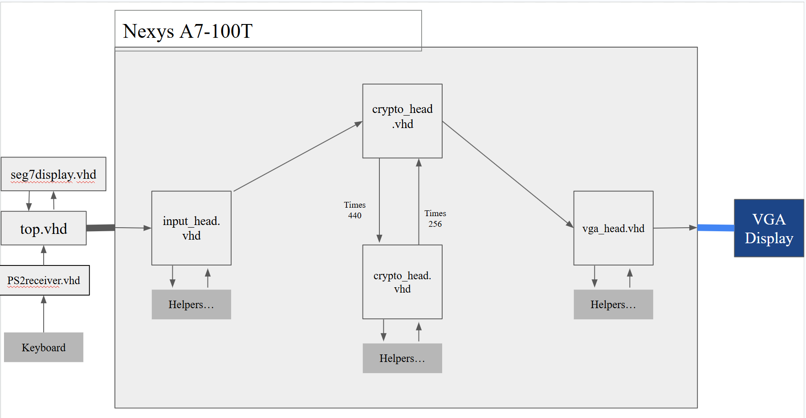
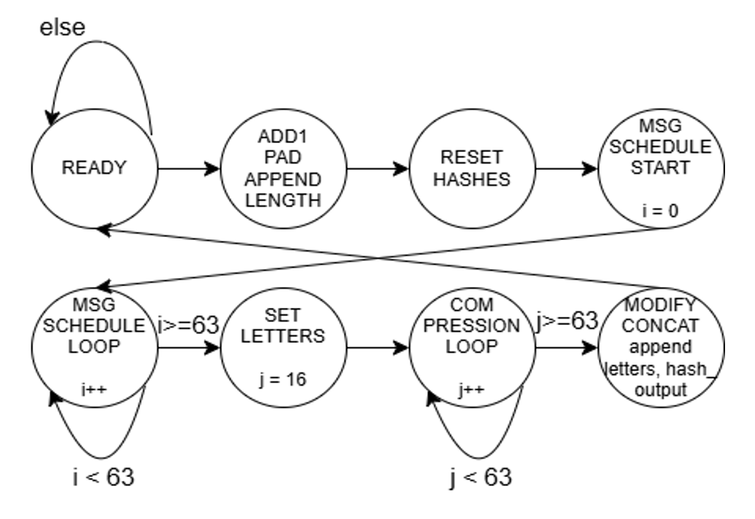
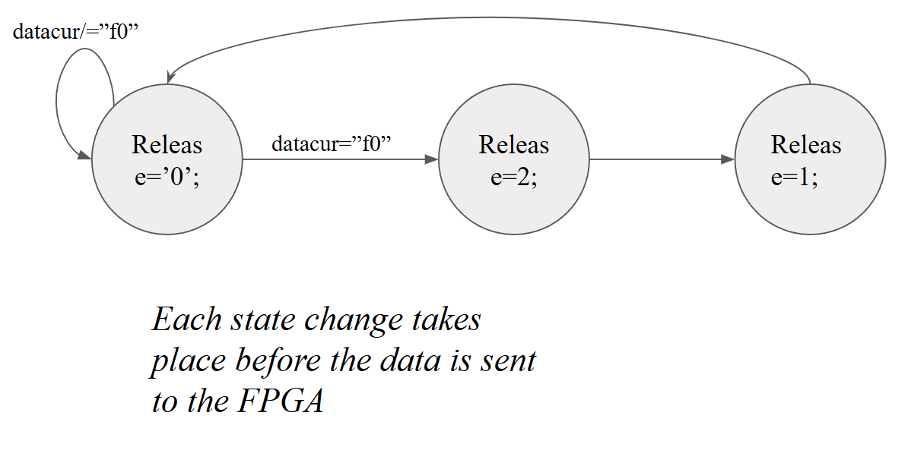
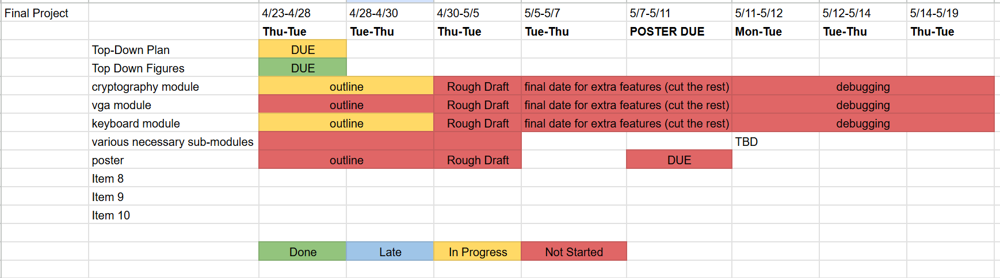

# cpe_487_finalProject_csecModule
*Theodore Rogalski, Ryan Manley, Mircea Florescu*
## Introduction
This project attempts to implement the SHA-256 hashing algorithm on a Nexys A7-100T FPGA using VHDL, with plaintexts entered using a USB keyboard and the output displayed through the VGA port on the FPGA.
## Expected Behavior 
The expected behavior of the system is as follows, first in sentences and then in bullet points.

### Written Description 
The user connects a keyboard and monitor to the FPGA  using the keyboard’s USB cable and VGA HDMI Adapter respectively. Then, they may upload the code onto the board, and will be able to type an arbitrary 32 bit (8 hex characters, 4 bytes, 4 ASCII characters) into it. As they type, they will see both the inputted text from the keyboard on the screen in ASCII as well as the plaintext run through the well known SHA-256 hashing algorithm as in the following image:


## Background
The SHA-256 hashing algorithm converts a plaintext into a 256-bit hash. Details on this process are available [here](https://www.boot.dev/blog/computer-science/how-sha-2-works-step-by-step-sha-256/#step-5---create-message-schedule-w). Implementing this algorithm on an FPGA requires the usage of a hardware design language, in this case VHDL. Convenient entry of plaintext is made possible by the usage of a peripheral keyboard. The result of the encoding may be displayed on the screen using the VGA port.
## Tutorial
Below is a video of the current state of project being demonstrated. It starts in the READY state, which has all values set to all 0's, particularly the hash output, which is shown in the second line. The plaintext starts off as displaying as 4 percent signs (%%%%) as that is the error code character I have chosen as the plaintext is also all 0's. A message can be entered with the alphanumeric keys and the spacebar, and btn0 allows for the plaintext to be hashed. Clicking btnr resets the hash output, but not the plaintext.
# Parts Needed
1. Nexys A7-100T FPGA Board
2. VGA-HDMI Connector (Ventron Brand confirmed working)
3. Keyboard with USB cable connection
4. Monitor with HDMI Port 

# Step-by-Step Instructions

1. Open the Vivado IDE (version 2025.2 confirmed working)
2. Download the CPE487_Cybersecurity_Module folder, and open it using the Vivado IDE
3. Click Generate Bitstream in the bottom left
4. Once the bitstream has finished generating, click "Open Hardware Manager" and then “Program Device”
5. Once device finishes programming, type on keyboard and watch as ASCII characters appear on the screen!
6. The higher text is the input, and the lower text is the SHA256 output for it
## Video below:

 
High Level System Diagram
 

FSM For SHA 256 Module
  

Filtration Mechanism


# Input, Output Description for Each Module 
## SHA-256 Module
### Introduction 
The SHA-256 Module is meant to take in input of a 440-bit plaintext std_logic_vector (the plaintext allowed for one "chunk" in the SHA-256 algorithm) along with how many bits are used in the plaintext input as part of the message (the input bits_used unsigned(63 downto 0)) and output a deterministic but chaotic output that can be used to infer that the message that was hashed was not modified. It also takes as input a 100 MHz clk std_logic signal from crypto_head.vhd, a reset std_logic signal (mapped from btnr in crypto_head.vhd), and outputs hash_output as a std_logic_vector(255 downto 0). The code, in the state that it is being submitted, has an unidentified issue that makes the output chaotic, as the output of the SHA-256 algorithm, but not exactly the expected output of the SHA-256 algorithm.
### Major Modifications
The SHA-256 module only consists of one file, sha256.vhd, but it contains an entire FSM that handles all the operations for the SHA-256 hashing algorithm.
### sha256.vhd
The inputs to sha256.vhd are shown more formally below:
clk : IN STD_LOGIC - This determines the clk signal for the FSM.
reset : IN STD_LOGIC - This serves as the signal to reset the FSM, its output, and its working variables and signals.
plaintext : in std_logic_vector(439 downto 0) - This is the plaintext that is meant to be hashed by the SHA-256 algorithm.
bits_used : in unsigned(63 downto 0) - This is an unsigned that communincates that amount of bits in the plaintext. Oftentimes in SHA256 implementations this is a multiple of 8, as that is the length UTF-8 characters.  
btn0 : IN STD_LOGIC - This dictates the exiting of the "READY" state and the execution of the hashing algorithm.
hash_output : out std_logic_vector(255 downto 0) - This is the hash output, being 256 bits long.

Shown below is a diagram of the curret state of the FSM.


## VGA Module
The VGA module starts with a large font array declaration, where each element of the array is a set of vectors defining the 5 by 7 character (where 0 is a blank pixel and 1 is a turned on pixel). Then, four helper functions are defined: iso8859_to_font, hex_digit_to_font, get_char_bit, and get_digit_char. iso8859_to_font defines a case converting the 26 uppercase letters, 10 digits, certain punctuation, and the spacebar character. The function uses the ISO 8859 standard for encoding the letters, as those are the received outputs from the keyboard. The hex_digit_to_font function converts an input hex digit to the requisite character for ease of user access (the get_digit_char function also does this, but for the decimal digits). Finally, the get_char_bit function retrieves the bits from a given array member.  
The actual VGA outputting is handled by the text_draw process, which is relatively simple. There are two if statements outputting to two separate levels of the screen. One if statement outputs the input plaintext from the keyboard, and the other outputs the hash output of the encryption module. If someone were to expand on this project in the future, a good place to start would be to add compatibility for an arbitrarily long text output, with some requisite method of scrolling through the output.
### Major Modifications
The main file of the VGA Module (vga_font.vhd) is primarily built off of [a previous year's Galaga project](https://github.com/michaelmosch15/CPE487galaga/blob/main/galaga.srcs/sources_1/new/galaga_game.vhd), siphoning off the relevant text drawing capacity (involving the character array and method for drawing to the screen).
### Inputs & Outputs
Inputs: 
Clock: 
100MHZCLK - A 100 MHz clock coming from the board

USB HID: 
PS2_CLK - The board’s built-in clock for the USB-A port (which is also referred to as the PS/2 port in the board’s master constraints file)
PS2_DATA - The data input from the USB-A port


7-Segment Display: 
SEG[6:0] - An array containing the seven segments for any given anode of the built-in display
DP - Decimal point for the array (unused for our purposes)
AN[7:0] - The anodes corresponding to each of the eight digits of the display

VGA Connector: 
VGA_R[3:0] - The four bits of the red output for the VGA connector
VGA_G[3:0] - The four bits of the green output for the VGA connector
VGA_B[3:0] - The four bits of the blue output for the VGA connector
VGA_HS - The horizontal sync speed
VGA_VS - the vertical sync speed

USB-RS232 Interface: 
UART_TXD - The USB-RS232’s transmit pin

## Keyboard Module
### Introduction 
The keyboard module for this project is takes in data from a USB-coneccted keyboard and puts it into a 32 bit (32 bits chosen for full display on the seven segment display on the FPGA, could be arbitrarily increased) std_logic_vector. The purpose of this module is twofold: firstly to allow a user to enter a realistic message into the SSHA-256 algorithm, and secondly to allow future projects to forgo the use of buttons in their project's entirely. This code is adpated from [this online demo project](https://digilent.com/reference/programmable-logic/nexys-a7/demos/keyboard?srsltid=AfmBOoqqI4njcBqFtA0dqAeLQ5OywOiShAH1nz5cMmf3-alkugWLdGOD). However, the original code had two issues: firstly, that it was written in verilog and the final project was meant to be in VHDL and that instead of simply shifting a code XX corresponding to the keyboard key pressed into the vector, an additional code F0XX was shifted upon button release. Thus, this module filters out those extra statements. 
### Major Modifications


The keyboard module, at a high level, consists of the following inputs, outputs: 

### top.vhd
CLK100MHZ : in std_logic: This signal is a 100MHz clock, inputted from the clock wizard. It is fed into a 100 MHz. The clock signal to the seven segment display is also fed this signal.


PS2_CLK : in std_logic: 
The PS2_CLK is the clock that is outputted from the connected keyboard module. It is present in the constrainst file.
PS2_DATA:in std_logic:
The PS2_DATA std_logic signal is a singular bit that is the left most bit on the shift register data structure that handles the bit stream inputs.

SEG : out std_logic_vector(6 downto 0:
The SEG signal (fed into the constraints file) activates the various line segments present in the hexidecimal display, allowing the user to view the keyboard input on the hexadecimal output.

AN  : out std_logic_vector(7 downto 0):
The AN signal, fed into the AN signal in the constraints file, controls whether each segment in the 8 hexadecimal character display is on. 
DP : out std_logic: The DP signal, set to permanently be one, is fed to the constraints file. 


UART_TXD : out std_logic:
UART_TXD converts the parallel bit stream coming from the keyboard into a std_signal. It is fed into the constraints.

Seg7display.vhd
x : in std_logic_vector(31 downto 0): 
The x vector represents the keycode data. It uses the digit variable, which loops through each four bit portion of x. 
```vhdl
process(clk) 
variable digit : std_logic_vector(3 downto 0);

begin
if rising_edge(clk) then
case(s) is
when "000" => 
digit:=x(3 downto 0);
when "001" =>
digit:=x(7 downto 4);

when "010" =>
digit:=x(11 downto 8);

when "011" =>
digit:=x(15 downto 12);

when "100" =>
digit:=x(19 downto 16);

when "101" =>
digit:=x(23 downto 20);

when "110" =>
digit:=x(27 downto 24);

when "111" =>
digit:=x(31 downto 28);

when others =>
digit:=x(3 downto 0);
end case;
case(digit) is 
when x"0" =>
SEG<="1000000";
when x"1" =>
SEG<="1111001";

when x"2" =>
SEG<="0100100";

when x"3" =>
SEG<="0110000";

when x"4" =>
SEG<="0011001";
when x"5" =>
SEG<="0010010";
when x"6" =>
SEG<="0000010";
when x"7" =>
SEG<="1111000";
when x"8" =>
SEG<="0000000";
when x"9" =>
SEG<="0010000";
when x"A" =>
SEG<="0001000";
when x"B" =>
SEG<="0000011";
when x"C" =>
SEG<="1000110";
when x"D" =>
SEG<="0100001";
when x"E" =>
SEG<="0000110";
when x"F" =>
SEG<="0001110";
when others => SEG<="0000000";
end case;
end if;
end process;
```
This process converts the digit signal into a value on the x vector, which is fed into the x vector, which is then displayed as data on the board.


clk : in std_logic:

SEG : out std_logic_vector(6 downto 0):

AN : out std_logic_vector (7 downto 0):
```
process(s)
begin
AN<="11111111";
if aen(conv_integer(unsigned(s))) = '1' then
AN(conv_integer(unsigned(s)))<='0';
end if;
end process;
end architecture;
```
This code continuously toggles the anode to be off (from the all one's s signal), thus allowing the board to be persistently on. The anode being '1' turns off the display segment. 

DP : out std_logic:


### ps2receiver.vhd
#### Overall Description
The code works in the following way, with comments interspered to explain steps:
```vhdl
if falling_edge(kclk) then
    case(cnt) is
-- the cnt variable is sequeuntially looped until it reaches 10, where it goes back
    when 0 =>
    cnt := cnt+1;
--  when 0, the bit is ignored as it is the start bit of the keyboard data

    when 1 => 
    datacur(0)<=kdata;
--  when 1 (and successive datas), the bit is shifted into the respective slot of datacur (this occurs for every bit in the PS2_DATA)

    cnt:=cnt+1;

    when 2 => 
    datacur(1)<=kdata;    
        cnt:=cnt+1;

    when 3 => 
    datacur(2)<=kdata;
        cnt:=cnt+1;

    when 4 =>
     datacur(3)<=kdata;
         cnt:=cnt+1;

    when 5 =>
     datacur(4)<=kdata;    
     cnt:=cnt+1;

    when 6 => 
    datacur(5)<=kdata;
        cnt:=cnt+1;

    when 7 => 
    datacur(6)<=kdata;
        cnt:=cnt+1;

    when 8 => 
    datacur(7)<=kdata;
        cnt:=cnt+1;

    when 9 =>
-- This checks if the variable release is greater than 0, meaning that it earlier encountered f0, which skips the extra f0XX. This is the filtration mechanism
    if release /= 0 then release := release - 1;
    end if;
    if datacur = x"f0" then
-- This sets the release variable (don't put in the datastream if the value is greater than 0)
     release:=2;
    end if;
    
    if release = 0 then
 --    If the data is a new key presss and not part of the f0XX, it shifts the new byte into the last part of the keycode out, thus shifting the output in a controlled manner.
-- to extend, simply change 31 to the size-1
        dataprev <= datacur;
        keycode <=  keycode(23 downto 0) & datacur;
    
    end if;
    cnt:=cnt+1;
    when 10 => 
    cnt := 0;
    
    when others => null;
    end case;
    end if;
end process;

```
#### Inputs & Outputs
```vhdl
clk : in std_logic```: 100 MHZ clock signal to coordinate synchronous processes in ps2receiver  
```vhdl
kclk ```: in std_logic: This is the 50MHZ clock 
```vhdl
kdata``` :in std_logic: This is the PS2_DATA signal that takes in input from the stream from the keyboard.
```vhdl
keycodeout ```: out std_logic_vector(31 downto 0): This signal is the 32 bit vector that is fed into the SHA-256 Module and the displays on the board. To extend, merely change the 31 to a larger number (up to 140 bits).
```


## SHA-256 Module


## VGA Module
The VGA module starts with a large font array declaration, where each element of the array is a set of vectors defining the 5 by 7 character (where 0 is a blank pixel and 1 is a turned on pixel). Then, four helper functions are defined: iso8859_to_font, hex_digit_to_font, get_char_bit, and get_digit_char. iso8859_to_font defines a case converting the 26 uppercase letters, 10 digits, certain punctuation, and the spacebar character. The function uses the ISO 8859 standard for encoding the letters, as those are the received outputs from the keyboard. The hex_digit_to_font function converts an input hex digit to the requisite character for ease of user access (the get_digit_char function also does this, but for the decimal digits). Finally, the get_char_bit function retrieves the bits from a given array member. 
The actual VGA outputting is handled by the text_draw process, which is relatively simple. There are two if statements outputting to two separate levels of the screen. One if statement outputs the input plaintext from the keyboard, and the other outputs the hash output of the encryption module. If someone were to expand on this project in the future, a good place to start would be to add compatibility for an arbitrarily long text output, with some requisite method of scrolling through the output.

A summary of the steps to get the project to work in Vivado and on the Nexys board (5 points of the Submission category)


Description of inputs from and outputs to the Nexys board from the Vivado project (10 points of the Submission category)

Inputs: 
Clock: 
100MHZCLK - A 100 MHz clock coming from the board

USB HID: 
PS2_CLK - The board’s built-in clock for the USB-A port (which is also referred to as the PS/2 port in the board’s master constraints file)
PS2_DATA - The data input from the USB-A port


7-Segment Display: 
SEG[6:0] - An array containing the seven segments for any given anode of the built-in display
DP - Decimal point for the array (unused for our purposes)
AN[7:0] - The anodes corresponding to each of the eight digits of the display

VGA Connector: 
VGA_R[3:0] - The four bits of the red output for the VGA connector
VGA_G[3:0] - The four bits of the green output for the VGA connector
VGA_B[3:0] - The four bits of the blue output for the VGA connector
VGA_HS - The horizontal sync speed
VGA_VS - the vertical sync speed

USB-RS232 Interface: 
UART_TXD - The USB-RS232’s transmit pin


## Summary of Development Process
The project followed the proceeding structure, with each member contributing according to their interests:

Timeline:



Difficulties Encountered:
Many major difficulties were encountered in the course of the project, the first being the overly ambitious scope. The usage of a sending/receiving antenna for encrypting received messages and transmission presented excessive technical difficulties, which caused the project scope to be scrapped. The following challenges were the most notable for each module:
- SHA256 Module: Given the huge amount of operations present in SHA256, the correct implementation, especially with the large lead time present in VHDL due to the syntehsis, implementation and generate bitstream processes caused major difficulties. This led to the completion of the project being delayed to the last minute.
- Keyboard Module: Although the conversion of the keyboard module from verilog tro VHDL presented difficulties in learning how to read a new HDL, the most difficult aspect of the module was by far the filtering. The slow feedback present in VHDL and unclear issues resulting from changes to the logical structure of the keyboard module resulted in challenges that caused the delay of project completion. This issue was solved by slowing down the iteration process and pair programming.
- VGA Sync: The VGA Sync module faced the tremendous challenge of converting every hexcode into an ASCII character, which was done by hand, a long process which was faced with many fragility issues.


System Integration:

The above is a high-level description of the system, with the connections between the VHDL modules described.
